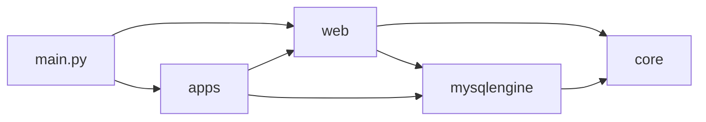

# 项目上下文（供大模型理解代码结构）

## 整体架构

基于 FastAPI 的 Web 应用，扁平包布局：入口 `main.py` 创建 FastAPI app，挂载全局异常处理与 `/api` 路由；请求经 web 层（依赖注入、异常、schema）进入各业务 app，业务层通过 mysqlengine 访问数据库。

## 顶层包职责

| 包               | 职责                                                                                                                    |
| ---------------- | ----------------------------------------------------------------------------------------------------------------------- |
| **core**         | 全局配置（config）、日志（logger）、路径（path）                                                                        |
| **web**          | HTTP 层：异常体系、依赖注入（get_db、transaction）、通用 schema（分页/响应/搜索/token）、全局异常 handler、中间件         |
| **apps**         | 业务应用集合，子应用挂载到 `/api`，各含 api/services/models/repositories/schemas                                        |
| **mysqlengine**  | 异步 SQLAlchemy 封装：Base、SessionLocal、baseModel、自定义字段、BaseRepository                                         |
| **commons**      | 跨应用通用工具：Decorators、Helpers、Metaclass、Utils                                                                   |
| **init**         | 系统初始化脚本（如 init_system.py）                                                                                     |
| **scripts**      | 运维/数据脚本（如 init_db、data）                                                                                       |
| **tests**        | 测试，结构与 commons 等镜像                                                                                             |
| **docs**         | 工程规范文档：分层架构（architecture/）、查询层规范（conventions/），入口见 docs/README.md                             |
| **model_spider** | 爬虫相关子模块，相对独立                                                                                                |

## 入口与路由

- `main.py`：创建 `FastAPI`，注册 `unknown_http_handler`、`unknown_exception_handler`，通过 `apps.api_router` 挂载所有业务路由（前缀 `/api`）。
- 各子应用 router 在 `apps/__init__.py` 中引入并挂到 `api_router`（system、password_lock、wechat、upload、workflow、oauth 等）。

## 依赖方向

- **core** 被所有包依赖，无业务依赖。
- **mysqlengine** 依赖 core；被 web（dependencies）、apps 使用。
- **web** 依赖 core、mysqlengine；被 apps 使用。
- **apps** 依赖 web、mysqlengine（及部分 commons）。

各目录更细的说明见对应目录下的 `README.md`。
