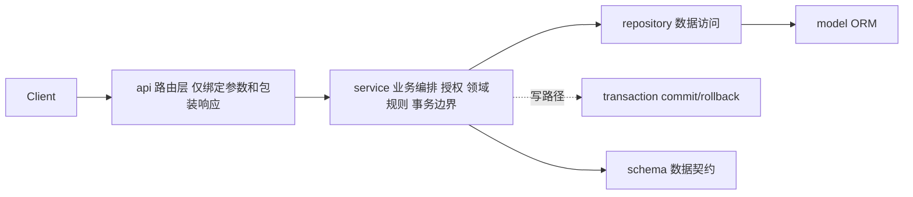
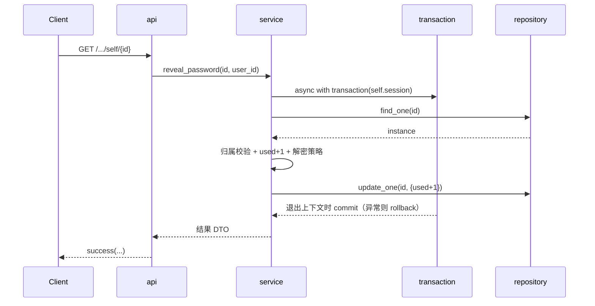

# home 业务应用分层设计规范

本规范定义 `src/home/apps/` 下各业务应用（app）的分层架构、各层职责、目录结构、数据流与编写约定。目标是让每个功能模块结构清晰、职责单一、可维护、可演进。以 `home.apps.password_lock` 作为落地样例。

> 适用范围：`src/home/apps/` 下所有子应用。新增模块应遵循本规范；存量模块在改造时逐步对齐。

---

## 1. 分层总览

在原有四层（api / models / repositories / schemas）基础上，**引入 service 业务层**，形成五层结构：



依赖方向（单向，禁止反向与跨 app 依赖）：

```
api -> service -> repository -> model
            \-> schema
```

---

## 2. 各层职责红线

### api（路由层 / controller）
- 只做：解析与校验请求参数、依赖注入、调用 service、用 `home.web.response.success(...)` 包装响应、声明 `response_model`。
- 不做：直接开启事务 / 触碰 repository、归属授权判断、计数等副作用、领域规则。
- 端点函数应「薄」：通常为「取参数 -> 调 service -> 包装返回」三步。

### service（业务层）
- 只做：业务规则与领域逻辑、归属/权限授权、副作用编排（如使用计数自增）、解密/加密等策略、决定事务边界。
- 事务边界：写操作用 `async with transaction(self.session):`（见 [`src/home/web/dependencies/session.py`](../../src/home/web/dependencies/session.py)）统一 commit / rollback 并转换数据库异常；只读操作不包事务（同一 session 内多次查询天然一致）。
- repo 持有：在构造函数里显式持有 `self.repo = XxxRepository(session)`，支持可选注入便于单测；不再使用 `SingleWorker` / `UnitWorker` / `get_repository` 这类服务定位器写法。
- 通过依赖工厂 `get_xxx_service(session=Depends(get_session))` 注入到 api。
- 资源主键与用户 ID 在 service / repository 签名中使用 `home.web.schemas.types.objectId`（非裸 `str`）；HTTP Path 参数同样使用 `objectId = Path(...)`。
- 需登录且必须带 `user_id` 的 api 使用 `user_id: objectId = Depends(get_required_user_id)`（见 `web/schemas/token.py`）；仅软登录场景用 `get_optional_user_id`。
- 不做：直接处理 HTTP 细节（status、header）、写裸 SQL；**不在同一文件混用 web 与 mysqlengine 两层 session**（见下文 `tasks/`）。

### tasks（后台任务层）
- 只做：脱离 HTTP 请求生命周期的异步任务（如 `BackgroundTasks.add_task`、未来 Celery/定时任务等）；自行 `open_session()` 管理 session，写路径用 `home.mysqlengine.transaction`。
- 路径：`src/home/apps/<app>/tasks/`（子应用级）或 `src/home/apps/<app>/<module>/tasks/`（子模块级，如 `notify/email/tasks/`）。
- 文件命名：`<action>_task.py`，导出顶层 async 函数（如 `send_email_record_task`），供 service 通过 `background_tasks.add_task(fn, ...)` 调度。
- 只依赖：`mysqlengine`（`open_session`、`transaction`）、本 app 的 repository/schema/channel 等领域模块。
- 禁止：import `home.web.dependencies.session`（HTTP 异常转换在此无意义）。
- service 职责：在 HTTP 路径内完成必要写库（如创建 PENDING 记录）后，仅 `add_task` 调度 tasks 层函数，不内联后台逻辑。

### repository（数据访问层）
- 只做：基于 SQLAlchemy 的查询与持久化，继承 `home.mysqlengine.repositories.BaseRepository`。
- 复杂查询作为方法补充，但应尽量复用基类逻辑，避免复制过滤/排序/分页代码。
- 过滤 / 排序 / 分页 / 自定义查询的统一写法见 [repository 查询层统一规范](../conventions/repository.md)（白名单、`build_query`、`paginate` 等）。
- 一律**只 flush、不 commit**；事务边界永远在 service。
- 主键 / 外键 user_id 参数使用 `objectId`，与 api、schema 层类型一致（见 [`docs/conventions/types.md`](../conventions/types.md)）。
- 不做：业务判断、权限校验。

### model（ORM 层）
- 只做：表结构映射（继承 `home.mysqlengine.baseModel`）、字段、索引、约束。

### schema（数据契约层）
- 只做：定义请求/响应的 Pydantic 数据契约，按用途拆分（见第 5 节）。
- 不做：业务逻辑。

---

## 3. 标准目录结构

```
src/home/apps/<app>/
├── __init__.py
├── consts.py                 # 枚举/常量
├── api/                      # 路由层（薄）
│   ├── __init__.py           # 子路由聚合，定义 prefix/tags
│   └── <resource>.py
├── services/                 # 业务层
│   ├── __init__.py           # 导出 service 与 get_xxx_service 依赖工厂
│   └── <resource>_service.py
├── repositories/             # 数据访问层
│   ├── __init__.py
│   └── <resource>_repository.py
├── models/                   # ORM
│   ├── __init__.py
│   └── <resource>.py
├── schemas/                  # 数据契约
│   ├── __init__.py
│   ├── <resource>.py         # Filter/Create/Update/Out
│   └── response.py           # 响应包装类型
├── tasks/                    # 可选：后台任务（脱离 HTTP，仅用 mysqlengine session）
│   ├── __init__.py
│   └── <action>_task.py
└── utils/                    # 可选：领域纯函数工具（无 HTTP、无 DB）
    └── __init__.py
```

子模块（如 `notify/email/`）可在模块内再设 `tasks/`，规则同上。

说明：领域纯函数工具（无 HTTP、无 DB）可放在 service 内或独立 `utils/`（如 `src/home/apps/sudoku/utils/`）；不应再用浮在 app 根目录的 `<app>_utils.py` 承载业务逻辑。后台任务放 `tasks/`，样例见 [`notify/email/tasks/send_email_task.py`](../../src/home/apps/notify/email/tasks/send_email_task.py)。

---

## 4. 数据流与事务边界

以「读取并消费某资源」为例（对应 password_lock 的取密码）：



要点：
- 事务起止由 service 内的 `async with transaction(self.session):` 决定，提交发生在上下文正常退出时，异常路径自动 rollback 并转换数据库异常。
- 一个用例中的多次数据访问应包在同一 `transaction` 上下文中，保证原子性。

---

## 5. schema 拆分约定

避免「一个 Schema 承担过滤/创建/更新/输出全部角色」。按用途拆分：

- `XxxFilter`：列表查询过滤条件；配合 FastAPI 依赖（`Annotated` / 工厂）生成，替代手写逐字段 `get_xxx_schema`。
- `XxxCreate`：创建入参；必填字段应声明为必填（不要一律 Optional）。
- `XxxUpdate`：更新入参；字段可选，配合 `exclude_unset`。
- `XxxOut`：输出 DTO；只暴露允许返回的字段，敏感字段（如明文密码）不得出现在输出契约中。

---

## 6. 命名与编写约定

- 路由 prefix 不要重复（避免 `/<app>/<app>` 这类冗余前缀）。
- 同一 app 内不同文件的端点函数避免重名，必要时按视角命名（如 `list_password_locks` vs `list_self_password_locks`）。
- 文件头注释（`# @File`）必须与真实路径一致，禁止复制粘贴残留。
- service 依赖工厂统一命名 `get_<resource>_service`。
- 模糊搜索拼接 `LIKE` 时需转义 `%` 与 `_` 通配符。

---

## 7. password_lock 样例对照

`src/home/apps/password_lock` 已按本规范落地，现状如下：

- `api/password_lock.py`、`api/searcher.py`：仅调用 `PasswordLockService`，函数体收敛为「调 service + success」。
- `services/password_lock_service.py`：`PasswordLockService` 提供 `list/get/create/update/delete/search_self/reveal_password`；`reveal_password` 承接原 `searcher` 的查找 + 归属校验 + `used+1` + 解密（原 `password_lock_utils.get_password` 已并入 `_extract_password`），写路径用 `async with transaction(self.session):` 包裹。
- `repositories/password_lock_repository.py`：复用 `BaseRepository` 逻辑，去除 `search_with_name_like` 的重复实现。
- `schemas/`：已拆分为 `PasswordLockFilter / Create / Update / Out`。

> 安全待办（经核实仍未修复）：`list/get/create/update/delete` 等 CRUD 仍缺少 user_id 归属校验（越权风险），`PasswordLockOut` 仍包含 `custom`（可能携带明文 `password`，敏感字段泄漏）。按既定计划在后续安全任务中修复；本规范已为其预留归口（授权属 service、字段过滤属 `XxxOut`）。
