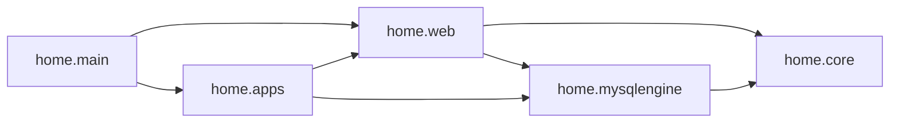

# 项目结构概览

供理解代码布局与技术分层；领域术语见根目录 [CONTEXT.md](../../CONTEXT.md)。

## 整体架构

基于 FastAPI 的 Web 应用，采用 **src layout**：主应用 Python 包位于 `src/home/`，入口 `home.main:app` 创建 FastAPI app，挂载全局异常处理与 `/api` 路由；请求经 web 层（依赖注入、异常、schema）进入各业务 app，业务层通过 mysqlengine 访问数据库。



## 目录结构

```text
home/
├── src/home/          # 主应用 Python 包
├── assets/            # 静态资源（static、template、translations）
├── spiders/           # Scrapy 爬虫（独立子项目）
├── tests/             # 单元测试
├── scripts/           # 运维脚本
├── init/              # 遗留初始化脚本
├── logs/  temp/       # 运行时目录
└── docs/
```

## 顶层包职责

| 包               | 路径              | 职责                                                                                                                    |
| ---------------- | ----------------- | ----------------------------------------------------------------------------------------------------------------------- |
| **home.core**    | `src/home/core/`  | 全局配置（config）、日志（logger）、路径（path）                                                                        |
| **home.web**     | `src/home/web/`   | HTTP 层：异常体系、依赖注入、通用 schema、全局异常 handler、中间件                                                        |
| **home.apps**    | `src/home/apps/`  | 业务应用集合，子应用挂载到 `/api`                                                                                       |
| **home.mysqlengine** | `src/home/mysqlengine/` | 异步 SQLAlchemy 封装：Base、SessionLocal、baseModel、BaseRepository                                              |
| **home.commons** | `src/home/commons/` | 跨应用通用工具：Decorators、Helpers、Metaclass、Utils                                                               |
| **init**         | `init/`           | 系统初始化脚本（遗留）                                                                                                  |
| **scripts**      | `scripts/`        | 运维/数据脚本                                                                                                           |
| **tests**        | `tests/`          | 测试                                                                                                                    |
| **docs**         | `docs/`           | 工程规范文档                                                                                                            |
| **spiders**      | `spiders/`        | Scrapy 爬虫，相对独立                                                                                                   |

## 业务子应用

挂载于 `home.apps.api_router`（前缀 `/api`）：

| 子应用          | 路由前缀              | 职责                                       |
| --------------- | --------------------- | ------------------------------------------ |
| **system**      | `/system`、`/oauth`   | 用户、认证、OAuth2 授权服务器              |
| **password_lock** | `/password_lock`    | 个人密码库                                 |
| **sudoku**      | `/sudoku`             | 数独谜题与完成记录                         |
| **upload**      | `/upload`             | 文件上传与分享链接                         |
| **wechat**      | `/wechat`             | 微信公众号消息与用户绑定                   |
| **notify**      | `/notify`             | 通知基础设施（当前为 email 渠道）          |

OAuth 授权端点位于 `system` 下的 `oauth_router`，不是独立 app。

## 入口与路由

- 启动：`uv run uvicorn home.main:app --reload --port 8090`
- `src/home/main.py`：创建 `FastAPI`，注册异常 handler，通过 `home.apps.api_router` 挂载所有业务路由（前缀 `/api`）。
- 各子应用 router 在 `src/home/apps/__init__.py` 中引入并挂到 `api_router`。

## 依赖方向

- **home.core** 被所有包依赖，无业务依赖。
- **home.mysqlengine** 依赖 core；被 web、apps 使用。
- **home.web** 依赖 core、mysqlengine；被 apps 使用。
- **home.apps** 依赖 web、mysqlengine（及部分 commons）。

各目录更细的说明见对应目录下的 `README.md`。
