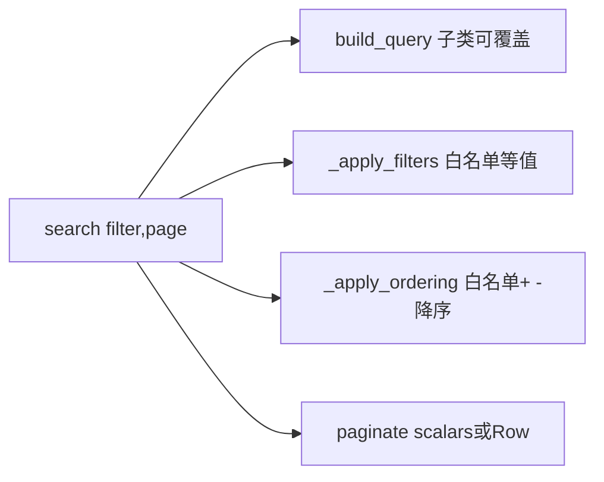

# repository 查询层统一规范

本规范定义 `repositories/` 下数据访问层在「过滤 / 排序 / 分页 / 自定义查询」上的统一写法。目标是消除各 repo 各自手写过滤/排序/分页代码的混乱，做到「声明 + 复用」。

> 适用范围：`apps/**/repositories/` 下所有 repository。新增遵循本规范；存量改造时对齐。

---

## 1. 核心理念：四段可组合原语

`mysqlengine.repositories.BaseRepository` 提供四段原语，`search` 由它们组合而成：



- **过滤**：`_apply_filters(query, count_query, filters)` —— 仅放行 `filterable_fields` 白名单内字段的等值过滤。
- **排序**：`_apply_ordering(query, page_schema)` —— 仅放行 `sortable_fields` 白名单内字段，支持 `-` 前缀降序。
- **分页**：`paginate(query, count_query, page_schema, *, scalars=None)` —— 统一计数 + offset/limit + 构建 `{data, pagination}`；`scalars=False` 时返回 Row 元组（join 多实体场景）。
- **查询构建**：`build_query(filters) -> (query, count_query)` —— 默认单表；子类覆盖以实现 join / 聚合 / 附加列。

---

## 2. 必须声明的类属性（安全基线）

每个会被用于列表查询的 repo **必须**显式声明白名单。未声明（`None`）即拒绝该能力：

```python
class UserRepository(BaseRepository[User]):
    model = User
    name = "user"

    filterable_fields = {"username", "description", "avatar"}
    sortable_fields = {"id", "create_at", "update_at", "username"}
    # returns_scalars 默认 True；join 多实体返回 Row 时置 False
```

- `filterable_fields` 为 `None` => 不允许任何过滤；`sortable_fields` 为 `None` => 不允许任何排序。
- **敏感字段不得进入 `sortable_fields`**（如 `credential`、`client_secret`、JSON `custom`），避免越权排序/信息泄漏面。
- 排序入参约定：`order_by=["-create_at", "username"]`，`-` 前缀为降序。

---

## 3. 三类标准写法

### 3.1 单表列表（最常见）

只声明 `model` + 白名单，直接复用基类 `search`，零额外代码：

```python
class WechatMsgRepository(BaseRepository[WechatMsg]):
    model = WechatMsg
    filterable_fields = {"msg_id", "msg_type", "msg_event", "msg"}
    sortable_fields = {"id", "create_at", "update_at", "msg_type", "msg_event"}
```

### 3.2 自定义 join / 聚合 / 附加列：覆盖 `build_query`

当过滤条件来自 `XxxFilter` schema 时，覆盖 `build_query` 即可，过滤/排序/分页仍走基类 `search`。
示例：`user_search_repository` 用相关聚合子查询把认证拍平为列（单条 SQL）：

```python
class UserSearchRepository(BaseRepository[User]):
    model = User
    returns_scalars = False          # 查询返回 (User, phone, email...) 行
    filterable_fields = {"username", "description", "avatar"}
    sortable_fields = {"id", "create_at", "update_at", "username"}

    def build_query(self, filters):
        flat = [self._flat_col(tt, name) for name, tt in _FLATTEN_FIELDS.items()]
        return select(User, *flat), select(func.count()).select_from(User)
```

### 3.3 入参含 schema 之外的运行期参数:自定义方法 + 复用原语

当查询需要 schema 之外的参数（如 `name_search`、`user_id`、日期范围）时，保留自定义方法，但**必须复用** `_apply_filters` / `_apply_ordering` / `paginate`，不得再手抄过滤/排序/分页：

```python
async def search_with_name_like(self, schema, page_schema, name_search=None):
    filters = schema.model_dump(exclude_unset=True, exclude_none=True)
    query, count_query = self.build_query(filters)
    query, count_query = self._apply_filters(query, count_query, filters)
    if name_search:                                  # 本方法专有逻辑
        like = or_(Model.name.like(f"%{name_search}%"), Model.website.like(f"%{name_search}%"))
        query, count_query = query.where(like), count_query.where(like)
    query = self._apply_ordering(query, page_schema)
    return await self.paginate(query, count_query, page_schema)
```

---

## 4. 统一约定（红线）

- **方法/返回契约**：列表查询统一返回 `{"data": [...], "pagination": PaginationSchema}`；DTO 转换在 service 层完成，repo 只返回 ORM / Row。
- **自定义查询**：优先覆盖 `build_query`；仅当入参超出 `XxxFilter` 时才新增自定义方法，且必须复用原语。
- **禁止**：在 repo 内手写 `count_query` + `offset/limit` + 组装分页（一律用 `paginate`）；复制 `-` 前缀排序解析（一律用 `_apply_ordering`）。
- **单条精确查找**：`find_one` / `find_one_or_none(schema)` 不走列表白名单（按已声明 schema 字段精确匹配）。
- **LIKE 转义**：模糊搜索拼接 `LIKE` 时注意转义 `%` 与 `_` 通配符。

---

## 5. 暂不在范围（后续演进）

- Django 风格 `field__op`（`gte`/`lte`/`in`/`like`/`ilike`）算子过滤，与 `XxxFilter` / `get_*_filter` 查询参数改造。
- cursor / keyset 分页（深翻页性能）。
- `PaginationSchema.count`（实为总页数）更名 `total_pages`（涉及前端契约，单独评估）。
